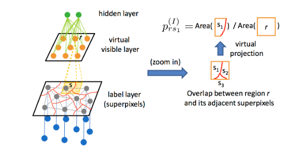

# Hair-extraction-using GLOC
(This project is still under development .....)
## Introduction
During the facial feature detection,i saw that traditional methods were not working when trying to identify hair, and extraction of hair. The task was even harder when the picture quality was very poor (eg - CCTV footage ). Hence the Superpixel concept and GLOC model was implemented to extract hair region. 

## over view
The conditional random field (CRF) is a powerful tool for building models to label segments in images. They are particularly appropriate for modeling local interactions among labels for regions (e.g., superpixels). Complementary to this, the restricted Boltzmann machine (RBM) has been used to model global shapes produced by segmentation models. In this work, we present a new model that uses the combined power of these two types of networks to build a state-of-the-art labeler, and demonstrate its labeling performance for the parts of complex face images. Specifically, we address the problem of labeling the Labeled Faces in the Wild data set into hair, skin and background regions. The CRF is a good baseline labeler, but we show how an RBM can be added to the architecture to provide a global shape bias that complements the local modeling provided by the CRF. This hybrid model produces results that are both quantitatively and qualitatively better than the CRF alone. In addition to high quality segmentation results, we demonstrate that the hidden units in the RBM portion of our model can be interpreted as face attributes which have been learned without any attribute-specific training data.

Successful Examples (Subtle Changes)

